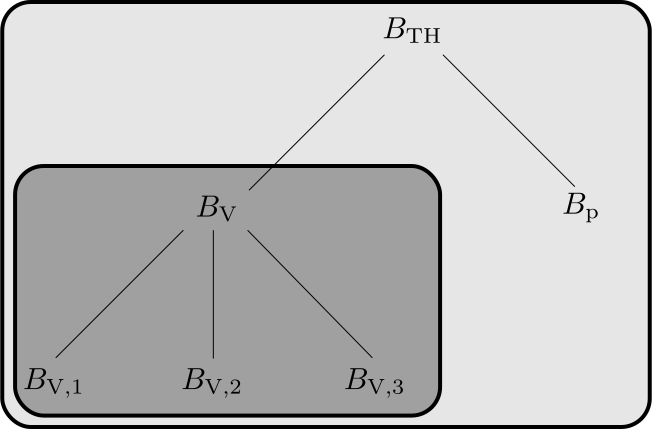

<!--
SPDX-FileCopyrightText: Copyright © DUNE Project contributors, see file AUTHORS.md
SPDX-License-Identifier: LicenseRef-GPL-2.0-only-with-DUNE-exception OR LGPL-3.0-or-later
-->

# The dune-functions module

## Functionality

The _dune-functions_ module provides an abstraction layer for global finite
element functions. Its two main concepts are functions implemented as callable
objects, and bases of finite element spaces.

### Functions

_dune-functions_ provides an interface to "functions" in the mathematical sense,
in particular to finite element functions defined on a grid, but going far
beyond that.

The interface revolves around the concept of a "callable". This encompasses any
type of C++ object that can be evaluated with `operator()`, like free functions,
function objects, and lambdas. Dynamic polymorphism is realized
using type erasure and the `std::function` class, which does not sacrifice
efficiency in purely static code.

_dune-functions_ extends the "callable" concept into several directions. First,
it allows for differentiable functions. Such functions can hand out their
derivative as new function objects. Second, for functions defined piecewisely
on a finite element grid, the concept of local function is introduced. Local
functions can be bound to grid elements. All further evaluations of a function
bound to an element are in local coordinates of that element. This approach
allows to avoid overhead when there are many consecutive evaluations of a function
on a single element.

### Function space bases

The second part of _dune-functions_ provides a well-defined interface to bases of
finite element function spaces. For this interface, a finite element basis is a
set of functions with a prescribed ordering, and a way to index them. The core
functionality has three parts:

1. For a given grid element, obtain the restrictions of all basis functions to
   this element, except for those functions where the restriction is zero. In
   other words: get the shape functions for the element.
2. Get a local numbering for these shape functions. This is needed to index the element stiffness matrix.
3. Get a global numbering for the shape functions. This is needed to index the global stiffness matrix.

While local numbers are always integers, global numbers can be multi-indices,
if appropriate.

A central feature of _dune-functions_ is the construction of finite element bases
for vector-valued and mixed spaces by tensor multiplication of simpler bases. The
resulting tensor multiplication expressions can be interpreted as rooted trees.
For example, the tree for the three-dimensional Taylor-Hood basis is shown below.
This tree structure is directly exposed in the _dune-functions_ interface.

### Implementations of Function Space Bases

Some of the finite element bases currently available are:

* `LagrangeBasis`: A k-th order Lagrangian bases, with k a run-time or compile-time parameter.
* `LagrangeDGBasis`: A k-th order DG basis, using Lagrangian shape functions.
* `NedelecBasis`: For H(curl)-conforming problems
* `RaviartThomasBasis`: For H(div)-conforming problems
* `BrezziDouglasMariniBasis`: The Brezzi-Douglas-Marini-Element
* `RannacherTurekBasis`: Combines the Rannacher-Turek element on quadrilateral elements with the Crouzeix-Raviart element on simplices
* `BSplineBasis`: A basis of B-Spline functions of given arbitrary order on a structured grid.

## Documentation

### Class documentation
The module contains a class documentation which can be build using [doxygen].
After the module has been build, you can build the documentation using
`make doc`
Additionally the pre-build doxygen documentation for the _master_ and
release branches is also hosted on the [documentation section][dune docs]
of the Dune website.

### Manual
There are two documents describing the concepts and use of _dune-functions_.
The interface for functions is described in the article

    C. Engwer, C. Gräser, S. Müthing, and O. Sander.
    The interface for functions in the dune-functions module.
    Archive of Numerical Software, 5(1):95--109, 2017.

This is freely available
via the [website of the journal][functions paper] and
as [arXiv:1512.06136][functions paper arxiv] preprint.
The interface for the function space bases is described in the article

    C. Engwer, C. Gräser, S. Müthing, and O. Sander.
    Function space bases in the dune-functions module.
    Preprint, arxiv:1806.09545, 2018.

This is freely available
as [arXiv:1806.09545][bases paper arxiv] preprint.
The LaTeX source code for both is also contained in the module.
Like the class documentation, it is build by `make doc`.

Finally, the [Dune book](https://link.springer.com/book/10.1007/978-3-030-59702-3)
also contains a chapter on _dune-functions_, which is, however, mainly
an improved presentation of the two articles.

### Examples
Several example applications demonstrate how to use the module. These
example applications are contained in the `examples/` directory and
they are built with `make examples`. The `stokes-taylorhood` example is
described in detail in the book.

### Communication channels
_dune-functions_ development and discussions happen mainly on the
[dune-functions GitLab page](https://gitlab.dune-project.org/staging/dune-functions).
There is also a [dune-functions mailing list](https://lists.dune-project.org/mailman/listinfo/dune-functions),
but it has very little traffic these days.

## Using dune-functions and licensing
The module is licensed by different variants of the GPL licence.
Please have a look at the `COPYING` file for more information
and a list of all contributors. When using _dune-functions_
please cite the publications on the
[functions interface][functions paper] and the
[bases interface][bases paper] listed above.

## Building dune-functions

Dune-functions integrates into the `cmake`-based Dune build system.
Hence it can be build (like any other module) using the `dunecontrol` script
of the _dune-common_ module. For details on how to use this build system
and how to specify build options have a look at the book or
the documentation in the _dune-common_ module.

### Dependencies
_Dune-functions_ depends on the dune [core modules][core]
and the [dune-typetree][typetree] module. All of them are available
in major Linux distributions. If you want their source codes
you can find them at:

* https://gitlab.dune-project.org/core/dune-common
* https://gitlab.dune-project.org/core/dune-geometry
* https://gitlab.dune-project.org/core/dune-grid
* https://gitlab.dune-project.org/core/dune-istl
* https://gitlab.dune-project.org/core/dune-localfunctions
* https://gitlab.dune-project.org/staging/dune-typetree

Release of _dune-functions_ happen together with releases of the Dune
core modules, and use the same numbering.

Unless explicitly stated otherwise for a specific version,
_dune-functions_ supports/requires the same build tools (compilers, cmake)
as the corresponding version of the core modules.

## Maintainers
_dune-functions_ has been originally written by

1. Christian Engwer
2. Carsten Gräser
3. Steffen Müthing
4. Oliver Sander

Additionally, significant contributions came from Ansgar Burchardt, Simon Praetorius,
and many others.

See the git history for a complete list.

We welcome interest and contributions by additional developers.

[core]: https://dune-project.org/groups/core
[typetree]: https://gitlab.dune-project.org/staging/dune-typetree
[dune docs]: https://dune-project.org/doxygen
[functions paper arxiv]: https://arxiv.org/abs/1512.06136
[functions paper]: http://journals.ub.uni-heidelberg.de/index.php/ans/article/view/27683
[bases paper arxiv]: https://arxiv.org/abs/1806.09545
[bases paper]: https://arxiv.org/abs/1806.09545
[doxygen]: http://www.stack.nl/~dimitri/doxygen/
